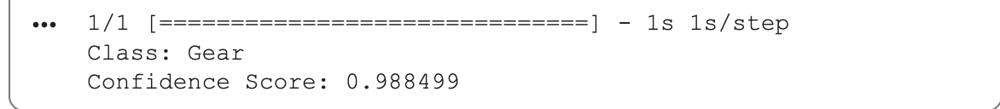
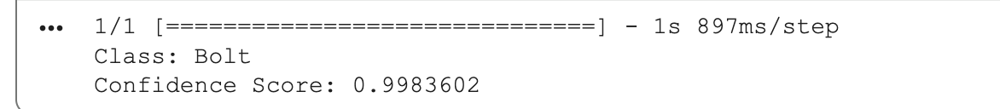

# Mechanical-Parts-Classifier
Image classification of mechanical parts (Bolt and Gear) using Google Teachable Machine and TensorFlow/Keras.

## Overview

This project uses Google Teachable Machine to classify two mechanical parts:

- Bolt
- Gear

The trained model was exported in TensorFlow/Keras format and tested using Python in Google Colab.

## Tools

- Google Teachable Machine
- Python
- TensorFlow / Keras
- Google Colab

## Project Files

- Bolt VS Gear.py – Python script for image prediction.
- keras_model.h5 – Trained model.
- labels.txt – Class labels.
- output_gear.png – Prediction result for a gear image.
- output_bolt.png – Prediction result for a bolt image.

## How It Works

1. Train the model using Google Teachable Machine.
2. Export the model in TensorFlow/Keras format.
3. Load the model using Python.
4. Input an image.
5. The model predicts whether the image is a Bolt or a Gear.

## Results

The model was tested using images from both classes and successfully classified:

### Gear Result 

### Bolt Result

## Prepared by

Hassan Wanqarah  
